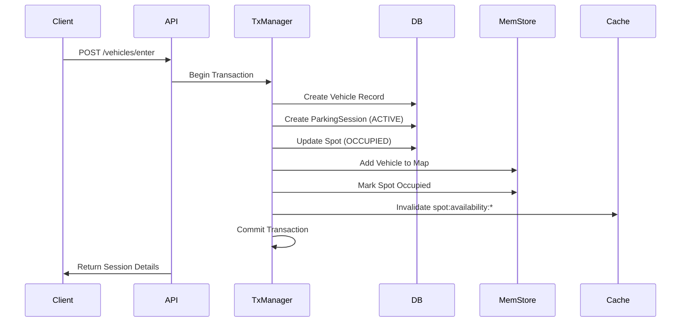
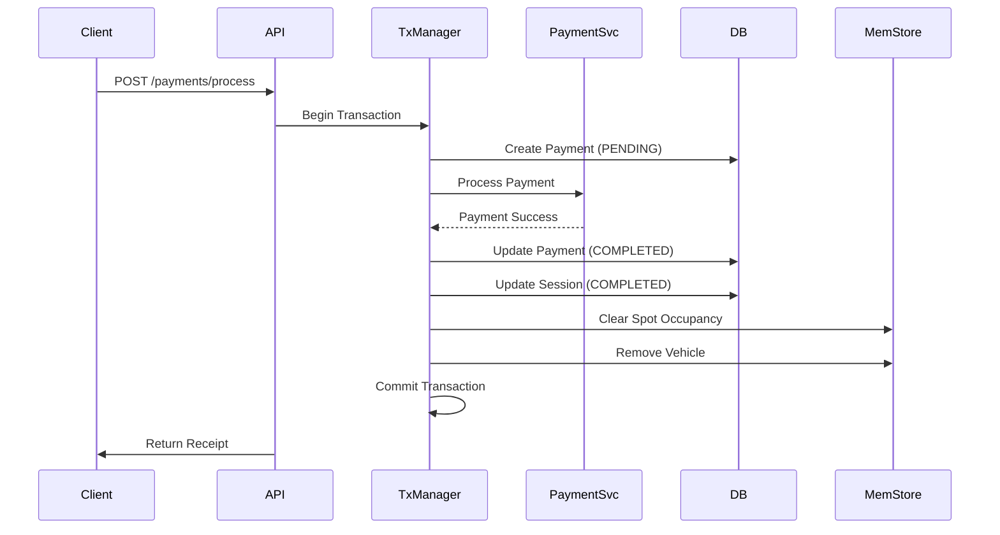
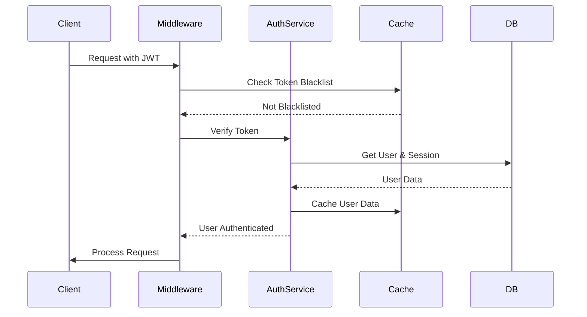

# State Management Architecture

## Overview

The ParkingGarage application employs a sophisticated multi-layered state management architecture designed for high performance, data consistency, and scalability. This document details how state is managed across different layers of the application.

## State Management Layers

### 1. Database Layer (Prisma + SQLite)

The database serves as the single source of truth for all persistent state.

**Key Components:**
- **ORM**: Prisma with SQLite database
- **Entities**: Vehicle, ParkingSession, Payment, Spot, Ticket, User, SessionToken
- **Lifecycle Management**: Each entity includes `createdAt`, `updatedAt`, and `deletedAt` fields
- **Status Tracking**: Enum-based status fields for state transitions

**Status Enums:**
```typescript
enum SessionStatus {
  ACTIVE
  COMPLETED
  CANCELLED
  EXPIRED
}

enum PaymentStatus {
  PENDING
  COMPLETED
  FAILED
  REFUNDED
  CANCELLED
}

enum TicketStatus {
  OPEN
  CLOSED
  VOID
}
```

### 2. In-Memory Cache (MemoryStore)

A singleton-pattern memory store provides O(1) lookups for real-time operations.

**Location**: `/src/storage/memoryStore.ts`

**Data Structures:**
```typescript
class MemoryStore {
  private spots: Map<string, Spot>           // Spot by ID
  private vehicles: Map<string, Vehicle>     // Vehicle by license plate
  private sessions: Map<string, Session>     // Active sessions by ID
  private spotsByLocation: Map<string, Set<string>> // Spots by floor/bay
}
```

**Key Features:**
- Fast lookups for spot availability
- Real-time vehicle tracking
- Floor/bay indexing for spatial queries
- No persistence between restarts

### 3. Transaction Management (TransactionManager)

Enterprise-grade transaction coordination ensures data consistency across operations.

**Location**: `/src/services/TransactionManager.ts`

**Capabilities:**
- **ACID Compliance**: Full transaction support with Prisma
- **Nested Transactions**: Savepoint-based nested transaction support
- **Retry Logic**: Automatic retry on deadlock (up to 3 attempts)
- **Metrics Collection**: Transaction performance tracking
- **Rollback Handling**: Automatic rollback on failures

**Transaction Flow:**
```typescript
async executeTransaction<T>(
  operation: (tx: PrismaTransaction) => Promise<T>,
  options?: TransactionOptions
): Promise<T>
```

### 4. Session & Authentication State

JWT-based stateless authentication with database-backed session management.

**Components:**
- **JWT Tokens**: Stateless authentication tokens
- **Session Tokens**: Database-tracked sessions with metadata
- **Device Tracking**: Fingerprinting and multi-device support
- **Token Blacklisting**: Revoked token tracking in cache

**Session Metadata:**
```typescript
interface SessionToken {
  token: string
  userId: number
  deviceId?: string
  ipAddress?: string
  userAgent?: string
  expiresAt: DateTime
  lastActivity: DateTime
  isActive: boolean
}
```

### 5. Cache Layer (Redis CacheService)

Distributed caching layer for performance optimization.

**Location**: `/src/services/CacheService.ts`

**Patterns:**
- **Cache-Aside**: Read-through caching pattern
- **TTL Management**: Automatic expiration
- **Pattern Invalidation**: Wildcard-based cache clearing
- **Namespace Isolation**: Logical cache separation

**Cache Keys:**
```
vehicle:<license_plate>
session:<session_id>
spot:availability:<floor>
payment:pending:<user_id>
```

## State Flow Examples

### Vehicle Entry Flow



### Payment Processing Flow



### Session Authentication Flow



## State Synchronization

### Consistency Mechanisms

1. **Database-First Updates**: All state changes originate from database transactions
2. **Event-Driven Sync**: MemoryStore updates triggered by successful DB operations
3. **Cache Invalidation**: Pattern-based cache clearing on state changes
4. **Optimistic Locking**: Version fields prevent concurrent modification conflicts

### Sync Points

- **Entry Operations**: DB → MemoryStore → Cache invalidation
- **Exit Operations**: DB → MemoryStore cleanup → Cache invalidation
- **Payment Updates**: DB → Session update → MemoryStore cleanup
- **Spot Changes**: DB → MemoryStore → Cache pattern invalidation

## Performance Optimizations

### Memory Store Benefits
- **O(1) Lookups**: Constant time spot availability checks
- **Reduced DB Load**: Frequent reads served from memory
- **Real-time Updates**: Immediate reflection of state changes

### Cache Strategy
- **Hot Data**: Frequently accessed data cached with TTL
- **Batch Operations**: Multiple cache operations in single round-trip
- **Smart Invalidation**: Pattern-based clearing minimizes cache misses

### Transaction Optimizations
- **Batch Updates**: Multiple operations in single transaction
- **Savepoints**: Partial rollback capability
- **Connection Pooling**: Reused database connections

## Scalability Considerations

### Current Architecture (Single Instance)

**Strengths:**
- Simple deployment
- No distributed state complexity
- Fast in-memory operations
- Consistent state management

**Limitations:**
- Single point of failure
- Memory constraints
- No horizontal scaling
- Loss of MemoryStore on restart

### Distributed Architecture (Future)

**Required Changes:**
1. **Replace MemoryStore**: Use Redis for distributed memory store
2. **Distributed Locking**: Implement Redis-based distributed locks
3. **Event Bus**: Add message queue for state synchronization
4. **Session Affinity**: Implement sticky sessions or distributed sessions
5. **Cache Coherence**: Use Redis pub/sub for cache invalidation

**Recommended Stack:**
- **State Store**: Redis Cluster
- **Message Queue**: RabbitMQ or Redis Streams
- **Distributed Lock**: Redlock algorithm
- **Cache**: Redis with pub/sub invalidation

## State Management Best Practices

### Do's
- ✅ Always use transactions for multi-step operations
- ✅ Invalidate cache after state changes
- ✅ Keep MemoryStore as read-through cache
- ✅ Use proper status enums for state transitions
- ✅ Implement retry logic for transient failures
- ✅ Log all state transitions for audit

### Don'ts
- ❌ Don't modify MemoryStore without DB update
- ❌ Don't rely on MemoryStore as source of truth
- ❌ Don't bypass transaction manager for updates
- ❌ Don't cache sensitive data without TTL
- ❌ Don't ignore cache invalidation patterns

## Error Recovery

### Transaction Failures
1. Automatic rollback on error
2. Retry with exponential backoff for deadlocks
3. Log failure details for debugging
4. Return meaningful error to client

### State Inconsistency
1. Database as source of truth
2. Periodic MemoryStore rebuild from DB
3. Cache invalidation on detection
4. Health checks for state validation

### Memory Leaks
1. TTL on cache entries
2. Periodic MemoryStore cleanup
3. Session expiration processing
4. Resource monitoring alerts

## Monitoring & Metrics

### Key Metrics
- Transaction success/failure rates
- Cache hit/miss ratios
- MemoryStore size and growth
- Session creation/expiration rates
- Database connection pool usage

### Health Checks
```typescript
interface HealthStatus {
  database: boolean
  memoryStore: boolean
  cache: boolean
  transactionManager: boolean
  sessionCount: number
  activeSpots: number
}
```

## Migration Path

### Phase 1: Current State
- Single instance deployment
- In-memory store for performance
- SQLite for persistence
- Local cache service

### Phase 2: High Availability
- Add Redis for distributed memory store
- Implement distributed locking
- Add health monitoring
- Setup failover mechanisms

### Phase 3: Horizontal Scaling
- Implement event bus for state sync
- Add load balancer with session affinity
- Scale out application instances
- Implement distributed tracing

### Phase 4: Global Distribution
- Multi-region deployment
- Eventually consistent replication
- CRDT for conflict resolution
- Edge caching strategy

## Conclusion

The current state management architecture provides a solid foundation for a parking garage management system. The layered approach with clear separation of concerns enables both high performance and maintainability. While optimized for single-instance deployment, the architecture is designed to evolve toward distributed systems as scaling needs arise.

For development and small-to-medium deployments, the current architecture offers an excellent balance of simplicity and performance. The clear upgrade path ensures that the system can grow with increasing demands without requiring a complete rewrite.